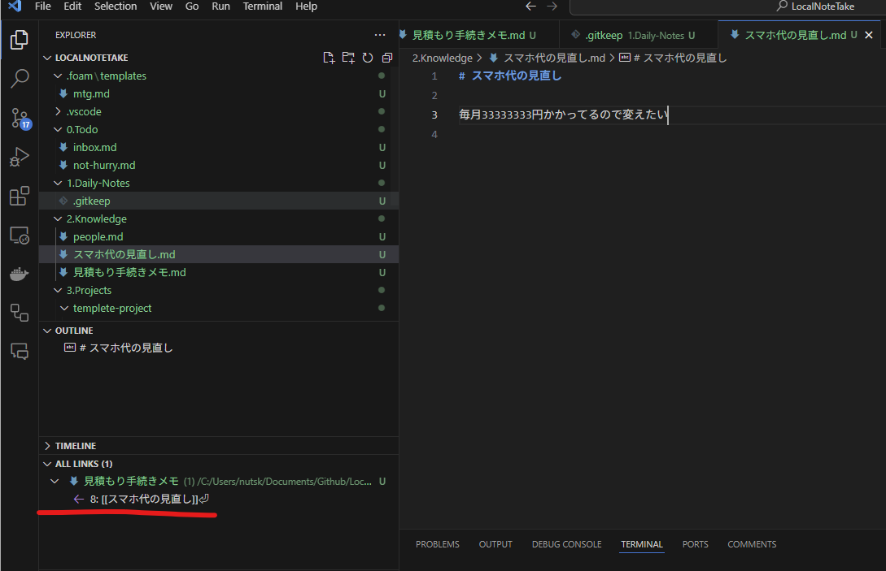

## LocalNoteTake
これはVSCodeを使ったメモ環境のテンプレートです。
[GitHub - foambubble/foam: ](https://github.com/foambubble/foam) を使用

## Shortcut
- 絵文字入力😄
  - Win: Ctrl + i
  - Mac: Cmd + i
- 画像貼り付け
  - Snipping Tool などでcopy した後にmarkdown上でCtrl+v(Cmd+v)
- Markdown preview
  - Ctrl+Shift+v(そのまま開く) 
    - (もう一度押すと戻ります)
  - Ctrl+k ➡️ v(サイドで開く)
    - (もう一度押すと戻ります)
- チェックボックス
  - Alt+c (Option+c)でチェックオンオフ
- 戻る
  - Mac:Ctrl+-
  - Windows:Alt+←

## Command
- Ctrl+Shift+P 
  - VSCodeのCommand Paletteを開く
- Command Palette 上のコマンド
  - 「Create New Note from Templete」でmtgを選ぶと打ち合わせが現在のファイル階層で作成
  - Urlを選択→Command Palette→「Expand URL to Markdown」でタイトル挿入

## Notation
  - `[[なにか]]` を入力してCtrl+マウスクリックで新規ファイルが出来る
  -  all linksにリンク元一覧が表示される

## Usage
- Project作成
  - 3.Projects 以下のtemplete-projectをフォルダごとコピーしてプロジェクト名を書き換え（例：お引っ越し！など）
  - その後の打ち合わせなどは「このファイルを開いてtempleteから生成.md」を開いておく
    - Command Palette→templete でmtg を入れて「キックオフ」などを入力してenterで適切なファイルが作られる
- daily-note(日報): Alt+d (Option+d)で日報ファイルを作成して開けます
